<!-- =========================================================
     HRISHABH GUPTA — GITHUB PROFILE
     Security Researcher · Post-Quantum Cryptography
========================================================= -->


<!-- ==================== BANNER ==================== -->

<picture>
  <source
    media="(prefers-color-scheme: dark)"
    srcset="./banner/dark.svg"
  />
  <source
    media="(prefers-color-scheme: light)"
    srcset="./banner/light.svg"
  />
  
</picture>

<br>


<!-- ==================== IDENTITY ==================== -->

<div align="center">

# Hrishabh Gupta

### Security Researcher · Post-Quantum Cryptography

**Building & Researching Quantum Migration Platforms**

📍 Indore, Madhya Pradesh  
🎓 M.Tech Software Systems · BITS Pilani

</div>

<br>

---

<!-- ==================== ABOUT ==================== -->

## `> whoami`

I work at the intersection of **Cybersecurity, Post-Quantum Cryptography, Software Engineering, and AI**, with a current focus on preparing systems for the transition from classical public-key cryptography to **quantum-resistant infrastructure**.

My current work explores **cryptographic discovery, migration planning, crypto-agility, hybrid TLS, and practical adoption of post-quantum cryptographic standards**.

```text
research.focus  = Post-Quantum Cryptography
current.mission = Quantum-Safe Migration
interests       = Security · Cryptography · AI · Infrastructure
status          = Building & Researching Quantum Migration Platforms
```

---

<!-- ==================== TECH STACK ==================== -->

## `> technology --stack`

<div align="center">


</div>

<br>

**Languages:** Python · Java · C++ · JavaScript  
**Frontend:** React · Vite  
**Backend:** Flask · FastAPI · Node.js  
**Database:** MySQL · MongoDB · Supabase  
**Infrastructure:** Docker · Kubernetes · AWS · Google Cloud  
**Tools:** VS Code · Git · Linux · Android Studio · Figma

---

<!-- ==================== RESEARCH ==================== -->

## `> research --active`

```text
[PQC]       Post-Quantum Cryptography
[MIGRATE]   Cryptographic Discovery & Migration
[TLS]       Hybrid / Quantum-Safe TLS
[AGILITY]   Crypto-Agile Infrastructure
[SECURITY]  Security Engineering
[AI]        AI-assisted Security Automation
```

---

<!-- ==================== GITHUB STATS ==================== -->

## `> github --stats`

<p align="center">


</p>

<p align="center">


</p>

---

<!-- ==================== CONTRIBUTION SNAKE ==================== -->

## `> contributions --animate`

<picture>
  <source
    media="(prefers-color-scheme: dark)"
    srcset="./dist/github-contribution-grid-snake-dark.svg"
  />
  <source
    media="(prefers-color-scheme: light)"
    srcset="./dist/github-contribution-grid-snake.svg"
  />
  
</picture>

---

<!-- ==================== CONNECT ==================== -->

## `> network --connect`

<div align="center">

<a href="https://www.linkedin.com/in/hrishabh1103/"></a>&nbsp;&nbsp;<a href="mailto:hrishabh1104@gmail.com"></a>&nbsp;&nbsp;<a href="https://hrishabhgupt.vercel.app/"></a>

</div>

<br>

---

<div align="center">

### `SECURITY` · `CRYPTOGRAPHY` · `PQC` · `AI` · `INFRASTRUCTURE`

**Preparing today's systems for tomorrow's cryptographic threats.**

</div>
